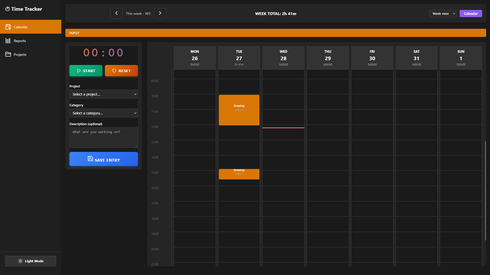
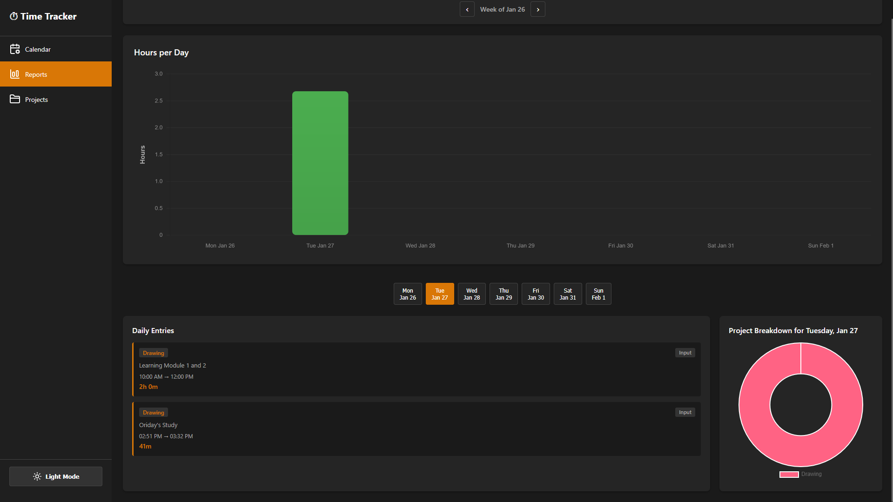
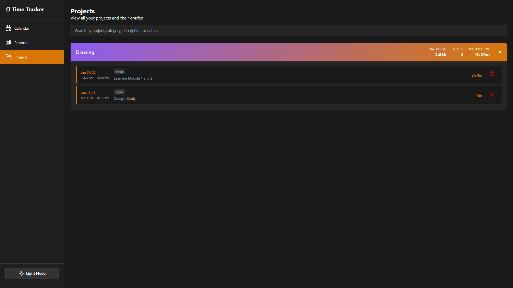
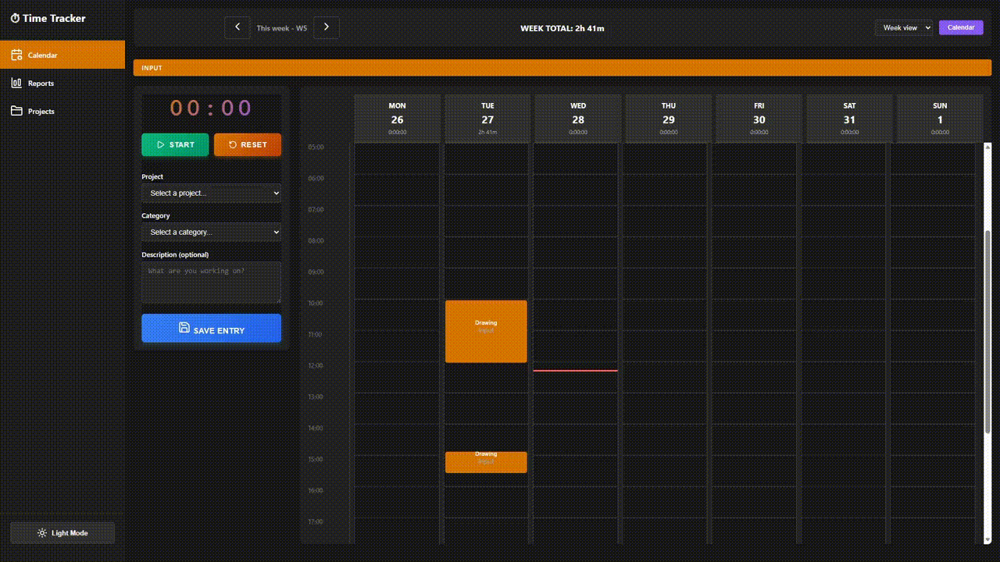

# Time Tracking App

An **offline** time tracking application built with FastAPI (Python) backend, Svelte frontend, and Docker. **No login** required and designed to run locally on your browser with JSON file storage.

Features:
- Start/stop timer for tasks
- Manual time entry creation
- Weekly calendar view
- Weekly reports with charts
- Project and category organization
- light/dark mode

> **Note**: 
> - I have not made it responsive yet, so best viewed on desktop browsers.
> - Categories and Projects are stored in localStorage on the client side. So if you clear browser data, you will lose them. You can re-create them as needed.

## Table of Contents
- [Requirements](#requirements)
- [Quick Start](#quick-start)
- [Screenshots](#screenshots)
- [Nerd Stuff](#nerd-stuff)
- [Development](#development)
- [Troubleshooting](#troubleshooting)
- [Future Enhancements](#future-enhancements)
- [License](#license)
- [Credits](#credits)

## Requirements

- [Docker](https://www.docker.com/get-started) & [Docker Compose](https://docs.docker.com/compose/install/)

## Quick Start

### Option 1: Using Startup Scripts (Recommended)

**Windows:**
```bash
# Start with dark theme (default)
.\start.bat

# Start with light theme
## .\start.bat light

# Start with dark theme (explicit)
## .\start.bat dark
```

**Linux/Mac:**
```bash
# Make script executable (first time only)
chmod +x start.sh

# Start with dark theme (default)
./start.sh

# Start with light theme
## ./start.sh light

# Start with dark theme (explicit)
## ./start.sh dark
```

## Screenshots

- Time Tracker


- Reports


- Projects Overview


- Demo GIF


> **There's also a light mode!**

---

# Nerd Stuff

## Features

✅ **Start/Stop Timer** - Real-time timer with pause and reset  
✅ **Manual Entry** - Create time entries manually with custom times  
✅ **Click to Create Entry** - Click anywhere on calendar to create a new entry via modal  
✅ **Click to Edit/Delete** - Click on any entry to edit or delete it  
✅ **Projects & Categories** - Organize time entries by project and category  
✅ **Weekly Calendar View** - Toggl-style calendar divided by week and day  
✅ **Daily Reports** - Bar and pie charts showing time breakdown  
✅ **Project Overview** - View all projects with expandable entry history  
✅ **Light/Dark Mode** - Toggle between themes via UI or startup flag  
✅ **Custom Projects** - Add and persist custom projects using localStorage  
✅ **JSON Storage** - All data saved locally as JSON files (no database needed)  
✅ **Robust Data Handling** - Auto-corrects total_duration if entries deleted from JSON  
✅ **Auto-updating Timer** - Start time always shows current time when timer is inactive  
✅ **Responsive Design** - Works on desktop and mobile browsers  
✅ **Auto Browser Launch** - Automatically opens browser on startup  

## Tech Stack

- **Backend**: FastAPI (Python 3.11)
- **Frontend**: Svelte 4 + Vite 5
- **Charts**: Chart.js
- **Storage**: JSON files (local) + localStorage
- **Containerization**: Docker & Docker Compose

## Project Structure

```
time_tracking_app/
├── backend/                 # FastAPI application
│   ├── main.py             # Main app entry point
│   ├── routes/
│   │   └── timers.py       # Timer endpoints
│   ├── models/
│   │   └── timer.py        # Data models
│   ├── data/               # JSON storage directory
│   ├── requirements.txt    # Python dependencies
│   └── Dockerfile
├── frontend/               # Svelte application
│   ├── src/
│   │   ├── App.svelte
│   │   ├── components/
│   │   │   ├── Sidebar.svelte
│   │   │   ├── Calendar.svelte
│   │   │   ├── Timer.svelte
│   │   │   ├── Modal.svelte       # Entry creation/editing modal
│   │   │   ├── Reports.svelte
│   │   │   └── Projects.svelte
│   │   ├── styles/         # CSS modules
│   │   │   ├── theme.css   # Theme variables
│   │   │   ├── calendar.css
│   │   │   ├── sidebar.css
│   │   │   ├── timer.css
│   │   │   ├── reports.css
│   │   │   └── projects.css
│   │   ├── stores/
│   │   │   └── theme.js    # Theme state management
│   │   ├── utils/
│   │   │   └── storage.js  # localStorage utilities
│   │   └── main.js
│   ├── package.json
│   ├── vite.config.js
│   └── Dockerfile
├── docker-compose.yml      # Docker orchestration
├── start.bat              # Windows startup script
└── start.sh               # Linux/Mac startup script
```

## About Quick Start

The bat/bash script will:
- Check if Docker is running
- Build and start both containers
- Automatically open your browser to http://localhost:5173
- Display the app in your chosen theme

## Local Development

### Backend
```bash
cd backend
pip install -r requirements.txt
python main.py
# Backend runs on http://localhost:8000
```

### Frontend
```bash
cd frontend
npm install
npm run dev
# Frontend runs on http://localhost:5173
```

Themes are managed through:
- CSS custom properties in `frontend/src/styles/theme.css`
- Svelte store in `frontend/src/stores/theme.js`
- localStorage for persistence across sessions

## API Endpoints

> Categories and Projects are client-side only and stored in localStorage.

### Timer Management
- `POST /api/timers` - Create new timer entry
- `GET /api/timers/{date}` - Get entries for a specific day (YYYY-MM-DD)
- `GET /api/timers/week/{start_date}` - Get entries for a week
- `PUT /api/timers/{entry_id}` - Update timer entry
- `DELETE /api/timers/{entry_id}` - Delete timer entry

### Statistics
- `GET /api/stats/week/{start_date}` - Get weekly statistics with project/category breakdown

## Data Storage

All data is stored as JSON files in the `backend/data/` directory:
- Files are named by date: `YYYY-MM-DD.json`
- Each file contains entries for that day with timestamps and durations
- Data persists between sessions

Example JSON structure:
```json
{
  "date": "2026-01-28",
  "total_duration": 3600,
  "entries": [
    {
      "id": "uuid-string",
      "project": "Development",
      "category": "Work",
      "description": "Building features",
      "start_time": "2026-01-28T09:00:00",
      "end_time": "2026-01-28T10:00:00",
      "duration": 3600
    }
  ]
}
```

## Development

### Add New Features

**Add a new timer endpoint:**
- Edit `backend/routes/timers.py`
- Update `backend/models/timer.py` if needed

**Add a new Svelte component:**
- Create new file in `frontend/src/components/`
- Import and use in `App.svelte`

### Rebuild Docker Image
```bash
docker-compose build --no-cache
```

## Troubleshooting

**Port conflicts:**
- Backend: Change port 8000 in `docker-compose.yml`
- Frontend: Change port 5173 in `docker-compose.yml`

**CORS errors:**
- Ensure backend is running on http://localhost:8000
- Check `API_URL` in frontend environment variables

**Data not persisting:**
- Ensure `backend/data/` directory is created
- Check file permissions in the data directory

## Future Enhancements

- Goal System
- Export data PDF/CSV/Excel/Whatever-i-don't-care
- Recurring tasks
- Time blocking/planning
- More Search functionality (?)
- Settings and preferences

## Credits

<div>
    <table align="center">
    <tr>
        <th align="center">User</th>
        <th align="center">Job</th>
    </tr>
    <tr>
        <td align="center">
        <a href="https://github.com/Cola1000">
            <br />
            <sub><b>Cola1000</b></sub>
        </a>
        </td>
        <td align="center">Everything</td>
    </tr>
    </table>
</div>

<div align="center" style="color:#6A994E;"> 🌿 Please Donate for Charity! 🌿</div>

<p align="center">
  <a href="https://tiltify.com/@cdawg-va/cdawgva-cyclethon-4" target="_blank">
    
  </a>
</p>
